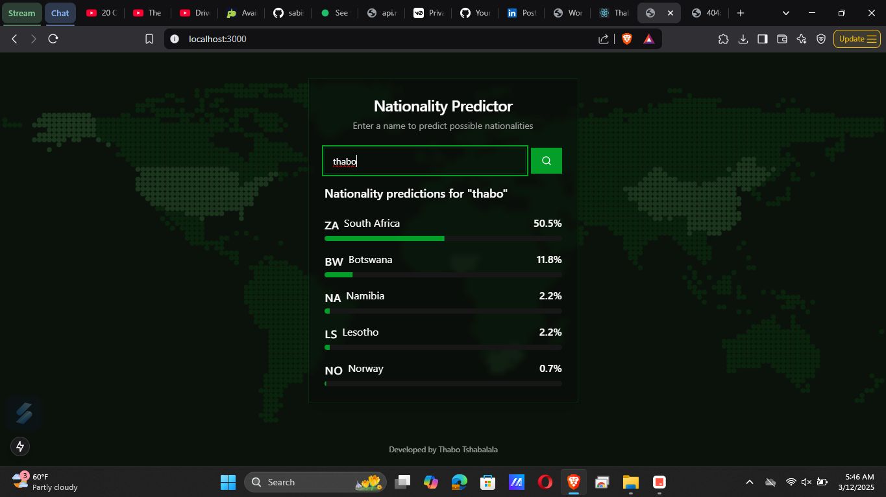

# Nationality Predictor

A web application that predicts the possible nationalities of a person based on their name. Built with Next.js, TypeScript, and Tailwind CSS.



## Features

- Predicts possible nationalities from a given name
- Displays probability percentages for each prediction
- Shows country flags for visual representation
- Smooth animations and transitions
- Responsive design for all devices
- Dark mode UI

## Tech Stack

- Next.js 14
- TypeScript
- Tailwind CSS
- Framer Motion
- Shadcn/ui Components
- Nationality API

## Getting Started

1. Clone the repository:
```bash
git clone https://github.com/yourusername/nationality-predictor.git